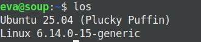

# los
l(o)s, show your OS and Kernel Version.

## Showcase


> [!NOTE]
> You can add -n to show your username and hostname <br>
> Format: {user}@{host}

## Install
Los is a tiny C++23 application.

### Prerequisities
Before we compile and install we need a few apps: git, cmake, ninja, gcc and g++
```bash
# Ubuntu/Debian
sudo apt install build-essential git cmake ninja-build gcc g++

# Fedora/Rocky/Alma
sudo dnf in git cmake ninja gcc gcc-g++

# Arch
sudo pacman -S git cmake ninja gcc g++
```

### Compiling
Now, we can compile the app.

First, we need to clone the repository.
```bash
git clone https://github.com/EveMeows/los.git
cd los
```

Now, we can compile the app.
```bash
export CC=gcc
export CXX=g++

mkdir build; cd build
cmake .. -G Ninja -DCMAKE_BUILD_TYPE=Release -DCMAKE_CXX_STANDARD=23

ninja
```
Annnnd, you're done! You can run the app by typing `./los`

But, if you want it to run from *anywhere* in your system, you need to move it into PATH. Fortunately, that's as easy as running a single command:
`sudo mv ./los /usr/local/bin`

## License
GPL 3.0
